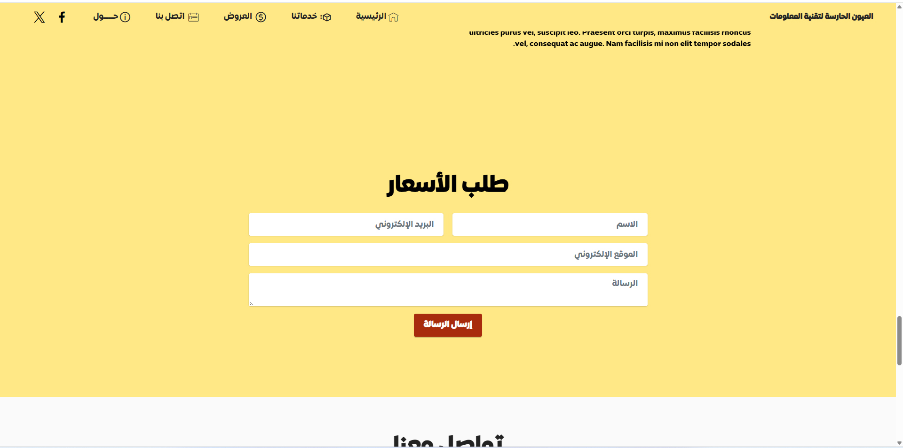
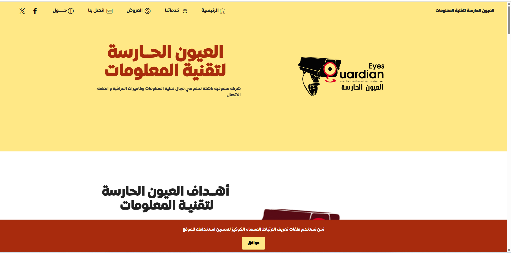
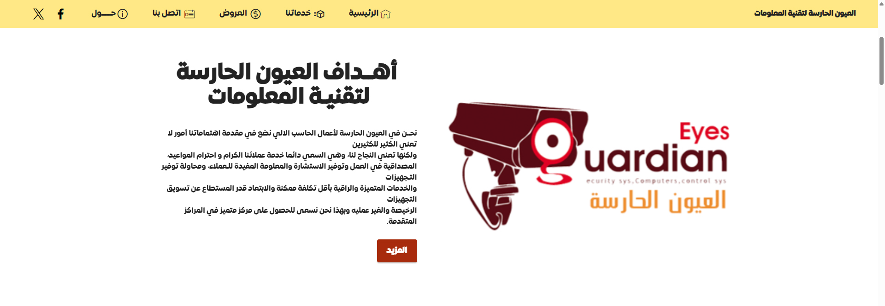
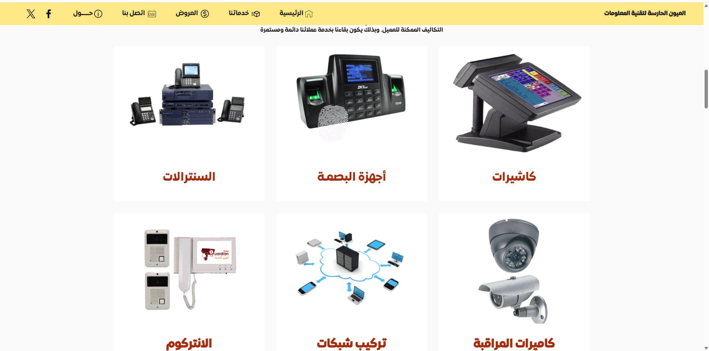

# 🛡️ Guardian Eyes لتقنية المعلومات 🇸🇦

شركة سعودية متخصصة في حلول الأمن والمراقبة، تقدم خدمات متكاملة في تركيب الأنظمة الذكية، وتوريد معدات مراقبة مصممة خصيصًا لتلبية احتياجات السوق المحلي.

---

## 🎯 نبذة عن المشروع

**Guardian Eyes** هو مشروع تقني متكامل تابع لشركة سعودية رائدة في مجال تقنية المعلومات، يهدف إلى توفير أنظمة أمنية عالية الجودة تشمل:

- كاميرات مراقبة داخلية وخارجية
- أنظمة إنذار الحريق
- أنظمة الاتصال الداخلي (Intercom)
- السنترالات الرقمية
- شبكات البيانات والاتصال
- أنظمة الحضور والانصراف بالبصمة
- توريد كاميرات مراقبة مصنعة خصيصًا للشركة

---

## 🧰 الخدمات التقنية

| الخدمة              | الوصف                                                             |
|---------------------|--------------------------------------------------------------------|
| 📷 كاميرات المراقبة | توريد وتركيب كاميرات عالية الدقة، مصممة خصيصًا باسم Guardian Eyes |
| 🔥 إنذار الحريق     | أنظمة كشف مبكر وتنبيه فوري للحريق، متوافقة مع المعايير السعودية |
| 🗣️ الانتركوم        | حلول اتصال داخلي للمباني السكنية والتجارية                        |
| ☎️ السنترالات       | تركيب وتشغيل سنترالات رقمية للمؤسسات                              |
| 🌐 الشبكات          | تصميم وتنفيذ شبكات داخلية وخارجية، سلكية ولاسلكية                |
| 🧬 البصمة           | أنظمة حضور وانصراف تعتمد على البصمة والتعرف البيومتري            |

---

## 🖼️ المعرض الفني
## 🖼️ واجهات الموقع







> 📂 الصور والنماذج متوفرة في مجلد `screenshot/`  
> وتشمل لقطات من مشاريع تركيب فعلية، نماذج من الكاميرات المصنعة، وتصاميم الأنظمة.

```markdown

## 🖼️ واجهات الموقع


### واجهة الموقع


